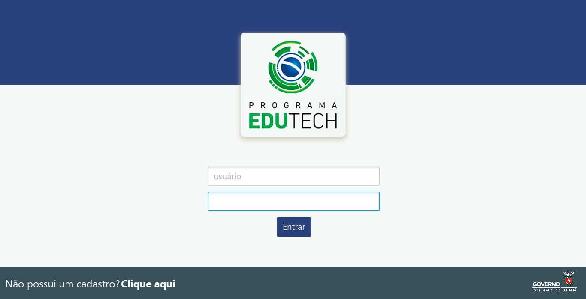
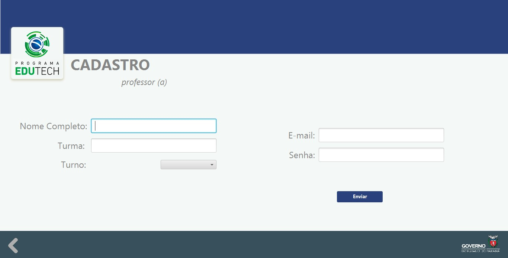
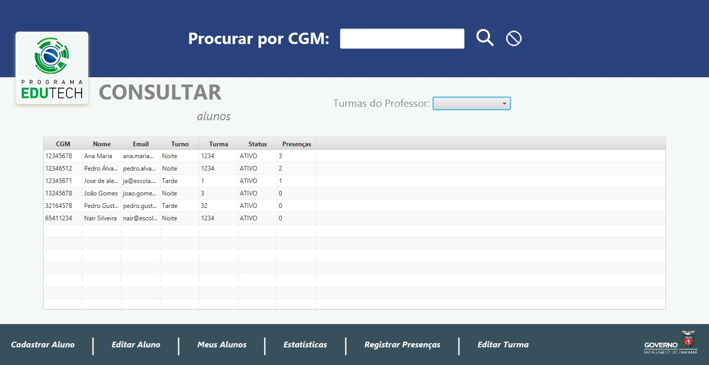
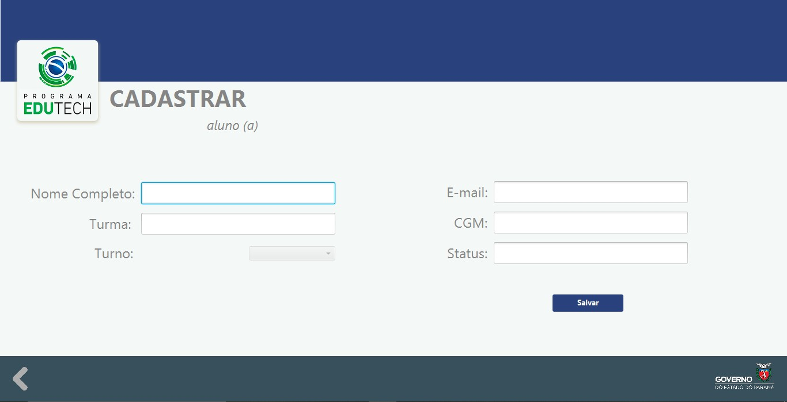
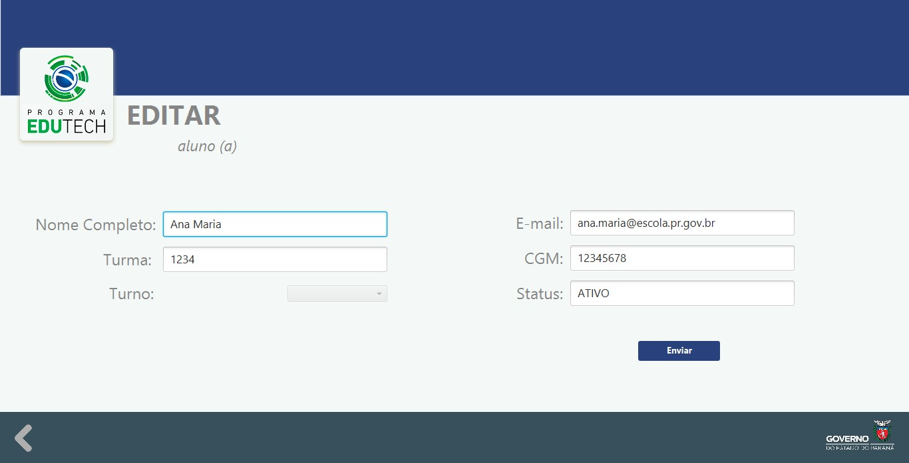
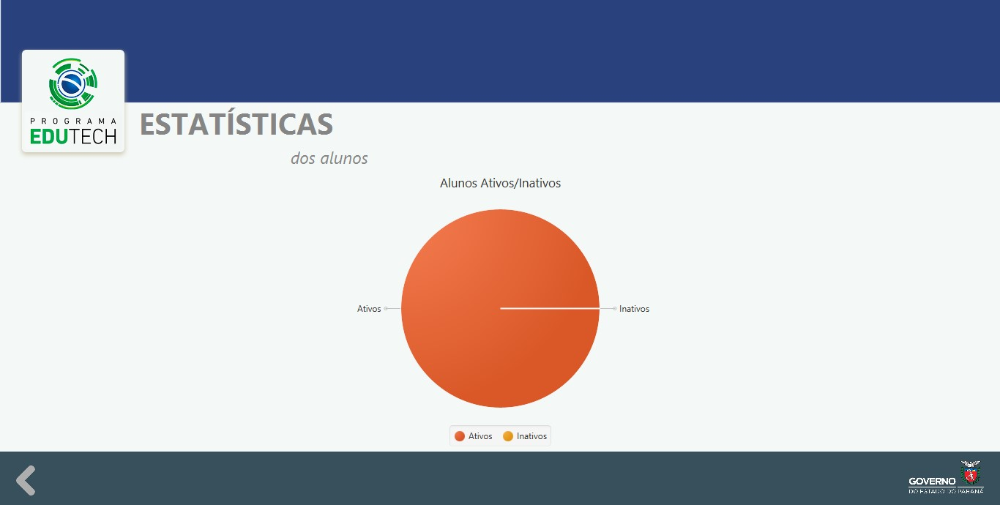
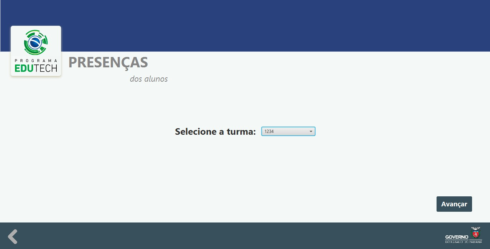
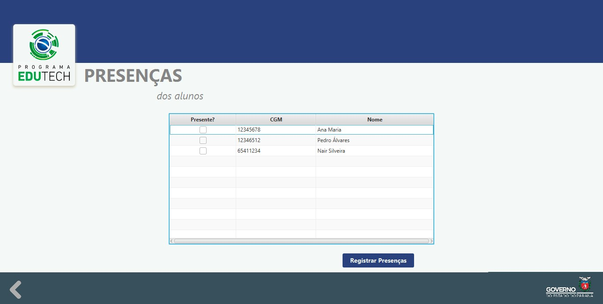

<h1 align="center"> 💻 Sistema EduTech 💻 </h1>

<h3 align="center">⚠️ <a href="https://www.oracle.com/java/technologies/downloads/#jdk17-windows">Necessário Java JDK 17 instalado no computador para rodar o projeto </a> ⚠️ </h3>

 
 

  
  

 ### Tabela de Conteúdos
   * [Descrição](#Descrição)
   * [Instalação](#Instalação)
   * [Funcionalidades](#funcionalidades)
   * [Imagens](#Imagens)

 

## Descrição

Este projeto foi desenvolvido para o <a href="https://www.educacao.pr.gov.br/programacao"> Desafio Edutech</a>. 
É um sistema de cadastro e manutenção de registros de alunos e professores usando um banco de dados <a href="https://www.mysql.com">MySQL</a> online. Se um professor se cadastrar e registrar um aluno, todos os outros que usarem o programa também irão ver esse registro.

 

## Instalação

Para usar o programa, é necessário ter a <a href="https://www.oracle.com/java/technologies/downloads/#jdk17-windows">Java JDK 17</a> e o <a href="https://www.java.com/pt-BR/download/ie_manual.jsp?locale=pt_BR"> Java</a> instalado no computador, se não, ocorrerá um erro JNI. Após instalada, é só preciso baixar a pasta Executável do projeto no Github e abrir com o Java o <b>edutech.jar</b>. Isso abrirá o programa.

 

## Funcionalidades  

- [X] Cadastro de Novos Alunos.
- [X] Cadastro de Novos Professores.
- [X] Edição de informações dos Alunos.
- [X] Alteração do Turno de uma Turma.
- [X] Filtros para Visualização de Alunos Registrados.
- [X] Estatísticas dos Alunos.
- [X] Sistema de Presenças.
- [X] Pesquisa por CGM do Aluno.
- [X] Verificação de Dados ao Cadastrar Alunos e Professores, e também ao Editar.
- [X] Banco de Dados 100% online, compartilhado entre todos os usuários.

 

## Imagens:

<h3 align="center">Tela De Login</h3>

 

<h3 align="center">Tela de Cadastro de Professor</h3>

 

<h3 align="center">Consulta dos Dados</h3>

 

<h3 align="center">Cadastro Aluno</h3>

 

<h3 align="center">Editar Aluno</h3>

 

<h3 align="center">Estatísticas</h3>

 

<h3 align="center">Registrar Presença 1</h3>

 

<h3 align="center">Registrar Presença 2</h3>

 

